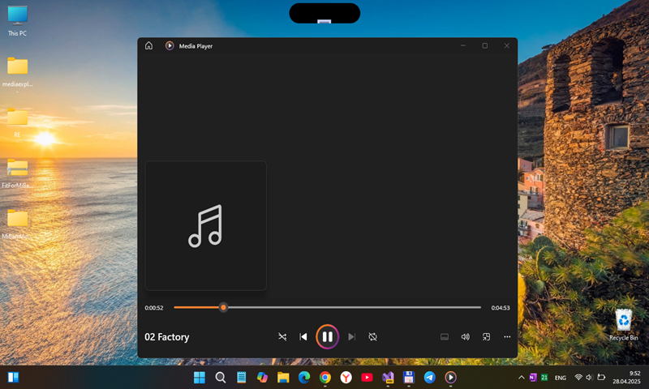
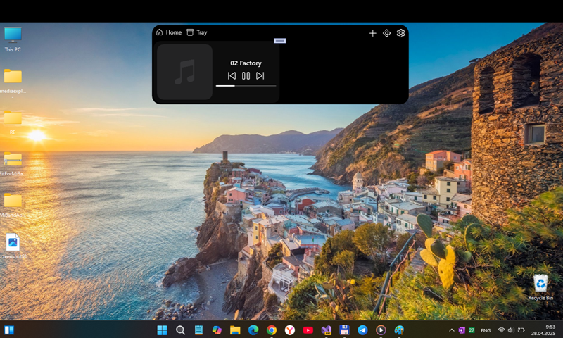

# DynamicIsland v1.0.0-alpha

## About
Long story in short: the idea for this application originally came to me when I saw the dynamic island on iPhone for the first time. After seeing that there are no (good) solutions to a Dynamic Island type application on Windows, I got the idea to make my own...

## Screenshots

## Tech. details
- I hope it compatible with Windows 11 Tiny (some os mods, with many, many cutted things)
- Target Framework: .NET 8.0
- Used workbench: Visual Studio 2022 Preview vith all updates (2025)
- Target OS version: 10.0.19041.0 (so, win 10 is good choise)
- Minimal supported OS version: 10.0.17763.0 (hello, old sweet Win10-based poor notebooks))))

## FAQ
F: downloaded your project and installed it successfully. but I can't launch it. any ideas?

A: with installing https://dotnet.microsoft.com/en-us/download/dotnet/thank-you/runtime-desktop-8.0.8-windows-x64-installer?cid=getdotnetcore it fixed !

## ..
As is. No support. Research only. DIY.

## .
[M][E] 2025